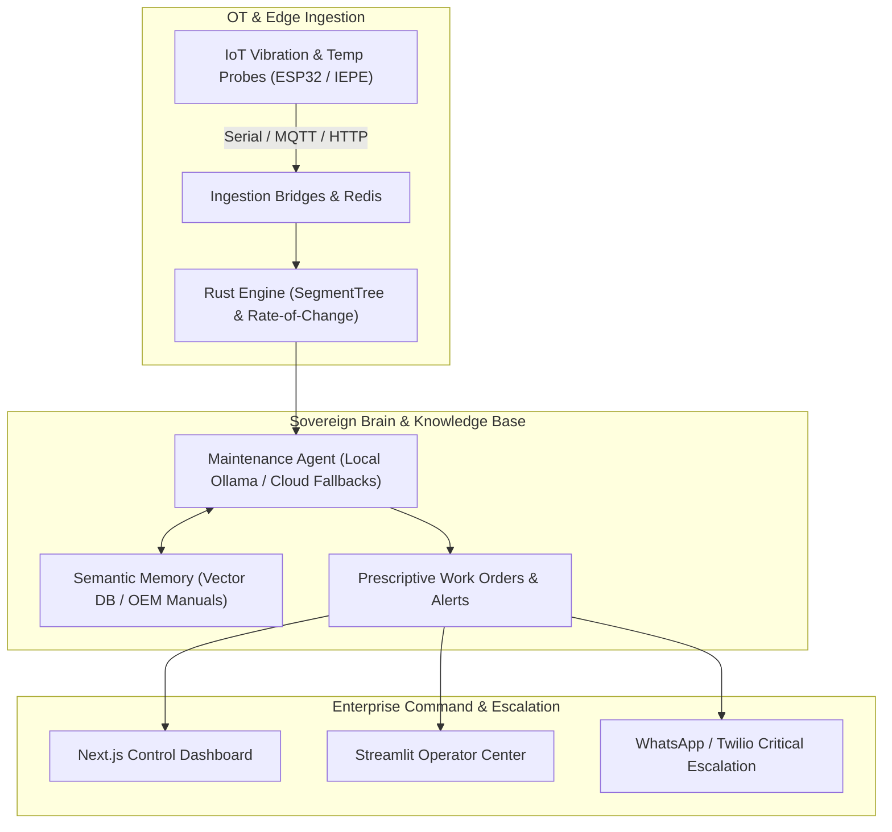

# 🏭 Sovereign Predictive Maintenance System
### *Autonomous Condition-Based Monitoring & Generative AI Diagnostics for Industry 4.0*

[](https://www.python.org/)
[](https://www.rust-lang.org/)
[](https://fastapi.tiangolo.com/)
[](https://nextjs.org/)
[](https://www.docker.com/)
[](tests/)
[](docs/standards/)

---

## 📖 Overview

The **Sovereign Predictive Maintenance System** is an enterprise-grade, condition-based monitoring and AI diagnostics platform designed for discrete manufacturing, process plants, and heavy engineering facilities. 

Built on the **Sovereign Industrial Backbone** (Levels 1–7), the system bridges the gap between low-level shop-floor sensors (vibration, temperature, current, pressure) and high-level autonomous maintenance intelligence. It detects micro-anomalies in rotating machinery before failure, delivers automated root-cause prescriptions, and speaks the technician's language through multilingual factory-floor reasoning.



---

## 🌟 Key Enterprise Capabilities

- **⚡ Native Rust Acceleration (Level 2):** High-speed PyO3-compiled Rust engine computing continuous range-max queries and signal trend calculations with sub-millisecond overhead.
- **🗣️ Multilingual Floor Reasoning (Level 2.5):** Powered by **Sarvam AI**, natively parsing Hinglish and Indic code-mixed speech/text logs directly from field technicians.
- **🛡️ Hybrid & Air-Gapped AI (Level 3):** Local-first sovereign inference via **Ollama (Qwen 2.5 / Mistral)** with seamless, resilient fallback to cloud LLMs (**Groq Llama 3.1 / Mistral AI**).
- **📚 Semantic RAG Memory (Level 4):** Vector-indexed technical manuals, schematics, and historical repair logs providing ground-truth context to prevent AI hallucination.
- **🔄 Sovereign IoT Ingestion (Level 5):** High-frequency multi-parameter telemetry streaming across Redis pub/sub channels and persistent ledger databases.
- **📊 Next.js Enterprise Dashboard (Level 6):** Real-time sensor charts, dynamic machine onboarding, health scoring, visual inspection uploads, and priority work schedules.
- **🚨 Industrial RBAC & Automated Escalation (Level 7):** Role-based access control (Admin, Operator, Technician) with instant WhatsApp escalation for high-severity anomalies.

---

## 📂 Repository File Structure

```
predictive_maintainance_system/
├── src/                                  # Core Backend Application
│   ├── agent/                            # Autonomous AI Agent, RAG & Multimodal Engines
│   │   ├── maintenance_agent.py          # Hybrid LLM Router (Ollama, Sarvam, Groq, Mistral)
│   │   ├── ocr_engine.py                 # Visual gauge reading & technical manual OCR
│   │   ├── reporter.py                   # Automated diagnostic report generator
│   │   └── cloud_provisioner.py          # Dynamic GPU instance manager
│   ├── api.py                            # FastAPI Endpoints & WebSocket Telemetry Stream
│   ├── auth.py                           # Role-Based Access Control & JWT Security
│   ├── cli/                              # Command-Line & Streamlit Interfaces
│   │   ├── dashboard.py                  # Operator Visual Control Center (Streamlit)
│   │   └── main.py                       # CLI diagnostic tools
│   ├── data/                             # Data Access Layer & Telemetry Ingestion
│   │   ├── analytics.py                  # Rate of change & failure probability calculations
│   │   ├── database.py                   # Sovereign Ledger database interface
│   │   ├── iot_ingestor.py               # High-frequency IPC sensor ingestor
│   │   ├── iot_simulator.py              # Factory floor sensor telemetry simulator
│   │   └── schema.py                     # Database schema initialization & migrations
│   ├── engine/                           # High-Performance Native Rust Module
│   │   ├── Cargo.toml                    # Rust build configuration
│   │   └── src/lib.rs                    # SegmentTree acceleration engine
│   ├── notifications/                    # Multi-channel notification dispatchers
│   │   └── whatsapp.py                   # Twilio WhatsApp alert escalation
│   └── services/                         # Business Logic Services
│       ├── alerts.py                     # Anomaly alerting & deduplication
│       ├── machine_insights.py           # Machine health score aggregation
│       └── priority_scheduler.py         # Maintenance task priority scheduler
│
├── frontend/                             # Next.js Enterprise Web Dashboard (React 19, Tailwind)
│   ├── src/                              # Pages, components, hooks, and state stores
│   └── package.json                      # Frontend dependencies and scripts
│
├── firmware/                             # Industrial Edge & Microcontroller Firmware
│   ├── esp32/
│   │   ├── predictive_node/              # Main multi-sensor node (vibration, temp, current)
│   │   ├── dht_sensor/                   # DHT sensor test sketch
│   │   └── mqtt_telemetry/               # Standalone MQTT telemetry firmware
│   ├── libraries/                        # Embedded C++ libraries (ESP-DASH, etc.)
│   │   └── ESP-DASH/
│   └── binaries/                         # Flashing binaries & ROMs
│       └── ESP32_GENERIC-20240222-v1.22.2.bin
│
├── tests/                                # Comprehensive Test Suite (17/17 Passing)
│   ├── unit/                             # Unit tests (test_agent.py)
│   ├── integration/                      # Integration & live test suites
│   │   ├── test_integration.py           # FastAPI endpoint integration tests
│   │   ├── test_orchestration.py         # Multi-turn orchestration tests
│   │   ├── test_slash_commands.py        # Slash command parsing tests
│   │   ├── run_architecture_tests.py     # Live server smoke test suite
│   │   └── test_500.py                   # Error handling verification test
│   └── fixtures/                         # Mock payloads, test audio, and gauge images
│       ├── test_data.json                # Sample maintenance logs
│       ├── test_audio.wav                # Audio input sample
│       ├── test_image.jpg                # Gauge image test asset
│       └── silent.wav                    # Silence audio sample
│
├── scripts/                              # System Utilities & Ingestion Bridges
│   ├── bridges/                          # Hardware telemetry bridges
│   │   ├── serial_bridge.py              # USB Serial to HTTP ingest bridge
│   │   └── mqtt_bridge.py                # MQTT to HTTP ingest forwarder
│   ├── tools/                            # AST & code validation tools
│   │   ├── check_jsx.py                  # JSX brace/tag balancer tool
│   │   └── check_strings.py              # String quote validation tool
│   ├── run_local.sh                      # Local multi-service startup script
│   ├── run_demo.py                       # Standalone pipeline simulation demo
│   ├── cleanup.sh                        # Stream and database reset utility
│   └── setup_local_ai.sh                 # Local Ollama AI setup script
│
├── docs/                                 # Documentation & Industrial Specifications
│   ├── standards/                        # International standards (ISO 14224, ISO 10816)
│   │   └── iso_14224_petrochemical_maintenance.pdf
│   └── research/                         # Architectural notes & research logs
│       └── think.txt
│
├── data/                                 # Persistent database storage & configuration
│   ├── factory_ops.db                    # SQLite sovereign operational database
│   ├── sample_maintenance_data.json      # Pre-seeded machine logs
│   └── config.json                       # Alert dispatch settings
│
├── Dockerfile                            # Multi-stage production container build
├── docker-compose.yml                    # Multi-service stack (Postgres, InfluxDB, Redis, Keycloak)
├── fly.toml                              # Fly.io production deployment spec
├── render.yaml                           # Render deployment blueprint
└── requirements.txt                      # Python production dependencies
```

---

## 🚀 Quick Start Guide

### 1. Environment Configuration

Create a `.env` file in the project root:

```bash
# Cloud Fallbacks (Optional if using pure local Ollama)
GROQ_API_KEY=your_groq_api_key
PINECONE_API_KEY=your_pinecone_api_key
SARVAM_API_KEY=your_sarvam_api_key
MISTRAL_API_KEY=your_mistral_api_key

# Local Sovereign Inference (Ollama)
OLLAMA_URL=http://localhost:11434/api

# Redis Pub/Sub
REDIS_HOST=localhost
REDIS_PORT=6379

# WhatsApp Escalation (Twilio)
TWILIO_ACCOUNT_SID=your_twilio_sid
TWILIO_AUTH_TOKEN=your_twilio_token
TWILIO_WHATSAPP_FROM=whatsapp:+14155238886
TWILIO_WHATSAPP_CONTENT_SID=HXxxxxxxxxxxxxxxxxxxxxxxxxxxxxxxxx
```

---

### 2. Launch with Docker Compose (Recommended)

Start the entire distributed sovereign stack with a single command:

```bash
docker-compose up --build
```

Services initiated:
- **FastAPI Core API:** `http://localhost:8000`
- **PostgreSQL / pgvector:** `localhost:5432`
- **Redis Cache & Streams:** `localhost:6379`
- **InfluxDB Time-Series:** `http://localhost:8086`
- **Keycloak IAM:** `http://localhost:8080`
- **Ollama AI Engine:** `http://localhost:11434`

---

### 3. Local Development (Manual Setup)

#### Step 1: Install Dependencies
```bash
# Python backend
pip install -r requirements.txt

# Compile native Rust acceleration engine
cd src/engine && cargo build --release && cp target/release/librust_engine.so ../rust_engine.so && cd ../..

# Frontend dashboard
cd frontend && npm install && cd ..
```

#### Step 2: Start Services
```bash
# Launch backend services (Redis, Simulator, Ingestor, API, Streamlit)
bash scripts/run_local.sh

# In a separate terminal, launch the Next.js control center
cd frontend && npm run dev
```

- **Next.js Dashboard:** `http://localhost:3000`
- **FastAPI Documentation:** `http://localhost:8000/docs`
- **Streamlit Control Center:** `http://localhost:8501`

**Default Credentials:**
- **Admin / Plant Manager:** `admin` / `admin123`
- **Field Operator:** `operator` / `op123`

---

## 📡 Sensor Ingestion & Hardware Telemetry

### HTTP JSON Telemetry Ingestion
Post real-time sensor frames to `/api/iot/ingest`:

```bash
curl -X POST http://localhost:8000/api/iot/ingest \
  -H "Content-Type: application/json" \
  -d '{
    "equipment_id": "CNC-01",
    "temperature": 72.4,
    "vibration": 2.15,
    "parameters": {
      "temperature": 72.4,
      "vibration_rms": 2.15,
      "pressure": 6.8,
      "rpm": 1450,
      "current_draw": 4.1
    }
  }'
```

### Hardware Ingestion Bridges
- **USB Serial Bridge:** Forward live ESP32 serial data to the backend:
  ```bash
  python scripts/bridges/serial_bridge.py
  ```
- **MQTT Broker Forwarder:** Subscribe to MQTT broker topics (`sensor/telemetry`) and stream to the API:
  ```bash
  python scripts/bridges/mqtt_bridge.py
  ```

---

## 🧪 Testing & Quality Assurance

Run the automated test suite using `pytest`:

```bash
# Run all unit and integration tests
pytest tests/ -v
```

Run live architecture smoke tests against a running server:

```bash
python tests/integration/run_architecture_tests.py
```

---

## 📜 Industrial Standards Aligned

- **ISO 14224:** Petroleum, petrochemical, and natural gas industries — Collection and exchange of reliability and maintenance data for equipment.
- **ISO 10816 / ISO 20816:** Mechanical vibration — Evaluation of machine vibration by measurements on non-rotating parts (Zones A to D classification).
- **IEC 62443:** Industrial communication networks — Network and system security (OT/IT zone segmentation).

---

## 📄 License

This project is licensed under the Apache 2.0 / MIT Enterprise License.
